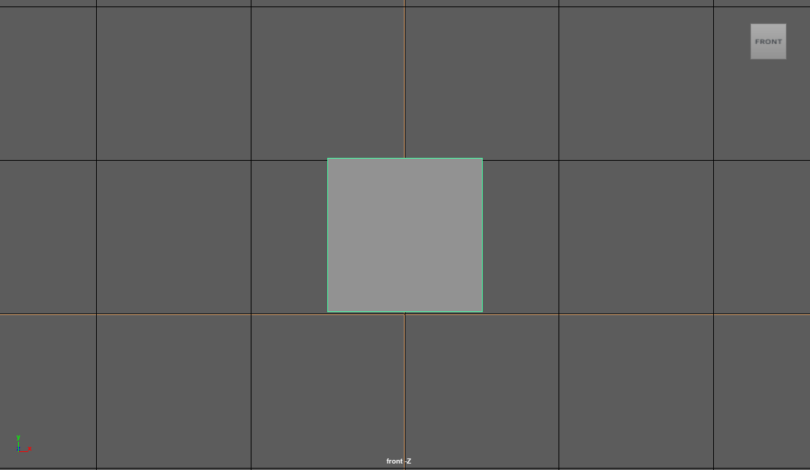

# 🏢 Transform Node Attributes

<details>

<summary><strong>Attribute Index</strong></summary>

[#1.-translate-t-double3](transform-node-attributes.md#1.-translate-t-double3 "mention")

[#2.-rotate-r-double3](transform-node-attributes.md#2.-rotate-r-double3 "mention")

[#3.-scale-s-double3](transform-node-attributes.md#3.-scale-s-double3 "mention")

[#4.-shear-sh-double3](transform-node-attributes.md#4.-shear-sh-double3 "mention")

</details>

## 1. translate(t) - _<mark style="color:green;">double3</mark>_

* translateX (tx) - _<mark style="color:green;">distance(double)</mark>_
* translateY (ty) - _<mark style="color:green;">distance(double)</mark>_
* translateZ (tz) - _<mark style="color:green;">distance(double)</mark>_

<details>

<summary>Specifies the object’s translation (Translate X, Y, and Z) attribute values in world space</summary>

* <mark style="color:green;">Is Keyable</mark>&#x20;
* 

</details>

Translation can be seen in channelBox and can be queried by -

```python
import pymel.core as pm
obj = pm.PyNode('objName')
print(obj.getTranslation())
```

## 2. rotate(r) - _<mark style="color:green;">double3</mark>_

* rotateX(rx) - _<mark style="color:green;">angle(double)</mark>_
* rotateY (ry) - _<mark style="color:green;">angle(double)</mark>_
* rotateZ (rz) - _<mark style="color:green;">angle(double)</mark>_

<details>

<summary>Specifies the object's scale ( Scale X, Y, and Z) attribute values in local space</summary>

* Unlike translation and rotation attributes, scale uses only the Local coordinate system.
* <mark style="color:green;">Is Keyable</mark>&#x20;
* .png>)

</details>

Rotation can be seen in channelBox and can be queried by -

```python
import pymel.core as pm
obj = pm.PyNode('objName')
print(obj.getRotation())
```

## 3. scale(s) - _<mark style="color:green;">double3</mark>_

* scaleX(sx) - _<mark style="color:green;">double</mark>_
* scaleY (sy) - _<mark style="color:green;">double</mark>_
* scaleZ (sz) - _<mark style="color:green;">double</mark>_

<details>

<summary><strong>Scale</strong> is used to scale a dag node in a 3D space</summary>

* <mark style="color:green;">Is Keyable</mark>&#x20;
* .png>)

</details>

Scale can be seen in channelBox and can be queried by -

```python
import pymel.core as pm
obj = pm.PyNode('objName')
print(obj.getScale())
```

## 4. shear(sh)- _<mark style="color:green;">double3</mark>_

* shearXY(shxy) _- <mark style="color:green;">double</mark>_
* shearXZ(shxz) _- <mark style="color:green;">double</mark>_
* shearYZ(shyz) _- <mark style="color:green;">double</mark>_

<details>

<summary>When the Shear XYZ values are changed from 0,0,0, shears or non-proportionately scales the selected geometry.</summary>

* <mark style="color:green;">Is Keyable</mark>&#x20;
*  (1).png>)
* 

</details>

Shear can be seen in AttributeEditor and can be queried by -

```python
import pymel.core as pm
obj = pm.PyNode('objName')
print(obj.getShear())
```

## 5. rotateOrder(sh)- _<mark style="color:green;">enum</mark>_

#### Rotate order explanation for Rigging-&#x20;


Kinda starts at 10:00 but to understand it properly watch from 8:23


#### Rotate order explanation for animation -&#x20;




<details>

<summary>This attribute controls the order in which rx, ry, rz are applied in the transformation matrix. Valid values for this attribute are 0=xyz, 1=yzx, 2=zxy, 3=xzy, 4=yxz, 5=zyx.</summary>

* <mark style="color:red;">Is not Keyable</mark>&#x20;
* .png>)

</details>

RotateOrder can be seen in AttributeEditor and can be queried by -

```python
import pymel.core as pm
obj = pm.PyNode('objName')
order = obj.rotateOrder.get()
orderDict = {0:'xyz', 1:'yzx', 2:'zxy', 3:'xzy', 4:'yxz', 5:'zyx'}
print (orderDict[order])
```


## 6. rotateAxis(ra)- _<mark style="color:green;">double3</mark>_

* rotateAxisX(rax) _- <mark style="color:green;">angle(double)</mark>_
* rotateAxisY(ray) _- <mark style="color:green;">angle(double)</mark>_
* rotateAxisZ(raz) _- <mark style="color:green;">angle(double)</mark>_

<details>

<summary>Extra rotation to adjust the local axis prior to applying the rotate attribute</summary>

* <mark style="color:red;">Is not Keyable</mark>&#x20;
* .png>)

</details>

rotateAxis can be seen in AttributeEditor and can be queried by -

```python
import pymel.core as pm
obj = pm.PyNode('objName')
roAxis = obj.rotateAxis.get()
print (roAxis)
```
